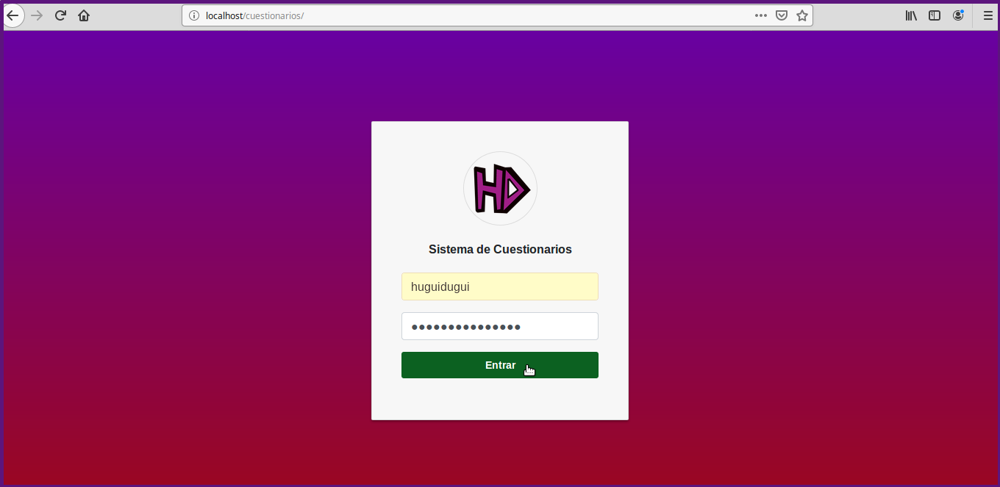
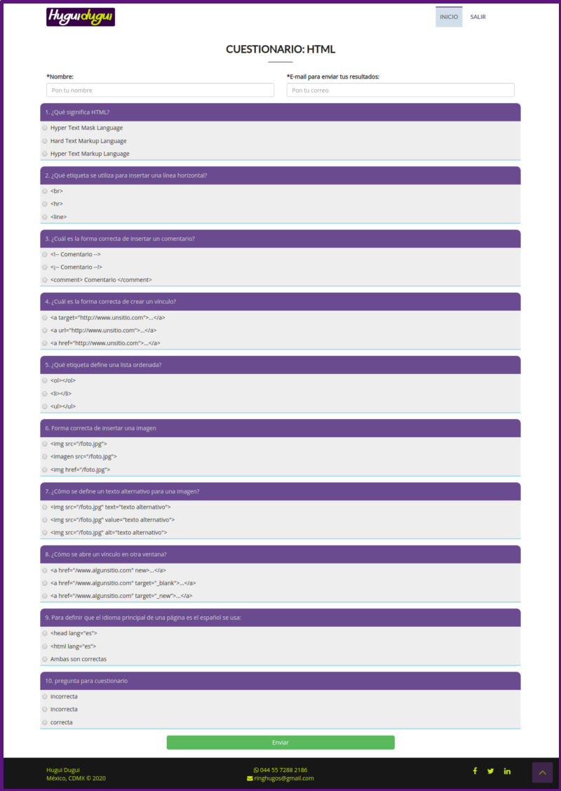

# cuestionarios
Proyecto personal.
Aplicación web de cuestionarios de opción múltiple hecha en Codeigniter 3.1.7

El sistema de cuestionarios tiene dos versiones:

1. Versión sencilla
2. Versión completa

==================================================

1. Versión sencilla

Consta de un login al sistema:

Mostrar los cuestionarios para elegir: 

Mostrar las preguntas del cuestionario:

